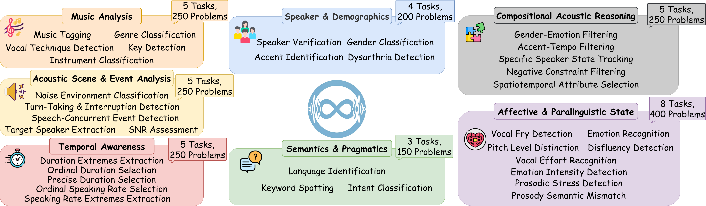

# MUGEN: Evaluating and Improving Multi-audio Understanding of Large Audio-Language Models

### The official GitHub page of the paper "MUGEN: Evaluating and Improving Multi-audio Understanding of Large Audio-Language Models"
- Authors: Chih-Kai Yang\*, Yun-Shao Tsai\*, Yu-Kai Guo†, Ping-Le Tsai†, Yen-Ting Piao‡, Hung-Wei Chen‡, Ting-Lin Hsiao‡, Yun-Man Hsu‡, Ke-Han Lu, Hung-yi Lee  (\*†‡Equal Contribution)
- Affiliation: National Taiwan University · NTU AI Center of Research Excellence (NTU AI-CoRE)
- Paper link: https://arxiv.org/abs/2603.09714

## Overview

<div align="center">
  
</div>

## Abstract

**TL;DR: We propose MUGEN, a benchmark for multi-audio understanding in LALMs, and show that current models, including proprietary ones, degrade sharply as the number of concurrent audio inputs grows.**

While multi-audio understanding is critical for large audio-language models (LALMs), it remains underexplored. We introduce MUGEN, a comprehensive benchmark evaluating this capability across speech, general audio, and music. Our experiments reveal consistent weaknesses in multi-audio settings, and performance degrades sharply as the number of concurrent audio inputs increases, identifying input scaling as a fundamental bottleneck. We further investigate training-free strategies and observe that Audio-Permutational Self-Consistency (APSC), which diversifies the order of audio candidates, helps models form more robust aggregated predictions, yielding up to 6.28% accuracy gains. Combining this permutation strategy with Chain-of-Thought further improves performance to 6.74%. These results expose blind spots in current LALMs and provide a foundation for evaluating complex auditory comprehension.

**Key findings**
- LALMs perform substantially better on semantic tasks than on non-semantic ones, exposing an uneven capability distribution.
- Accuracy declines steadily as the number of concurrent audio candidates increases — input scaling is a systematic bottleneck.
- Chain-of-Thought alone fails to resolve auditory perception bottlenecks; Audio-Permutational Self-Consistency (APSC) yields the largest gains, especially when combined with CoT.

## News

- Our paper is now available on [arXiv](https://arxiv.org/abs/2603.09714).
- Our dataset is released on HuggingFace! All 35 tasks are available at [MUGEN-Benchmark](https://huggingface.co/MUGEN-Benchmark).

## Benchmark

MUGEN contains 9,250 audio clips across **35 tasks** organized into **7 evaluation dimensions**: Semantics & Pragmatics, Speaker & Demographics, Affective & Paralinguistic State, Temporal Awareness, Acoustic Scene & Event Analysis, Music Analysis, and Compositional Acoustic Reasoning. Each question is formulated as 5-way multiple choice over candidate audio clips; ten tasks additionally include a reference audio for reference-conditioned comparison.

See `data/README.md` for the data schema and `evaluation/README.md` for the LLM-judge protocol.

## Baselines

- DeSTA2.5-Audio
- Qwen2.5-Omni-7B
- Audio Flamingo 3
- Voxtral-Mini-3B, Voxtral-Small-24B
- Phi-4-Multimodal-Instruct
- Gemini-3-pro (Low / High thinking levels)
- Cascade baseline: Whisper-large-v3 + Gemini-3-pro (ASR + LLM)

Open-source models are run with vLLM under greedy decoding (Voxtral uses the authors' recommended `temperature=0.2, top_p=0.95`; Gemini-3-pro uses `temperature=1`).

## Leaderboard

Accuracy (%) on MUGEN across seven dimensions: Semantics & Pragmatics (S&P), Speaker & Demographics (S&D), Affective & Paralinguistic (A&P), Temporal Awareness (TA), Acoustic Scene & Event Analysis (AS&E), Music Analysis (MA), and Compositional Acoustic Reasoning (CA). Overall is the micro-average over all tasks. "Low" / "High" denote the thinking levels of Gemini. Best within each group in **bold**.

<table>
<thead>
<tr>
<th>Model</th><th>S&amp;P</th><th>S&amp;D</th><th>A&amp;P</th><th>TA</th><th>AS&amp;E</th><th>MA</th><th>CA</th><th>Overall</th>
</tr>
</thead>
<tbody>
<tr><td colspan="9" align="center"><em>Open-source LALMs</em></td></tr>
<tr><td>DeSTA2.5-Audio</td><td align="center">46.67</td><td align="center">22.00</td><td align="center">21.75</td><td align="center">17.20</td><td align="center">30.40</td><td align="center">18.00</td><td align="center"><b>28.40</b></td><td align="center">24.91</td></tr>
<tr><td>Qwen2.5-Omni</td><td align="center"><b>70.00</b></td><td align="center">12.00</td><td align="center"><b>32.50</b></td><td align="center">15.20</td><td align="center">10.80</td><td align="center"><b>53.20</b></td><td align="center">18.00</td><td align="center"><b>28.69</b></td></tr>
<tr><td>Audio Flamingo 3</td><td align="center">25.33</td><td align="center">22.50</td><td align="center">15.00</td><td align="center">21.20</td><td align="center">23.20</td><td align="center">1.20</td><td align="center">19.20</td><td align="center">17.43</td></tr>
<tr><td>Voxtral-Mini-3B</td><td align="center">59.33</td><td align="center">25.50</td><td align="center">30.00</td><td align="center">20.00</td><td align="center">22.40</td><td align="center">24.80</td><td align="center">23.60</td><td align="center">27.83</td></tr>
<tr><td>Voxtral-Small-24B</td><td align="center">64.67</td><td align="center"><b>27.50</b></td><td align="center"><b>32.50</b></td><td align="center">22.80</td><td align="center">22.40</td><td align="center">25.60</td><td align="center">16.80</td><td align="center">28.63</td></tr>
<tr><td>Phi-4-Multimodal-Instruct</td><td align="center">52.00</td><td align="center">21.00</td><td align="center">21.00</td><td align="center"><b>28.00</b></td><td align="center"><b>24.80</b></td><td align="center">24.80</td><td align="center">24.80</td><td align="center">26.29</td></tr>
<tr><td colspan="9" align="center"><em>Proprietary LALM</em></td></tr>
<tr><td>Gemini-3-pro (Low)</td><td align="center">89.33</td><td align="center">68.00</td><td align="center">77.00</td><td align="center">48.00</td><td align="center">55.60</td><td align="center"><b>69.60</b></td><td align="center">69.20</td><td align="center">67.66</td></tr>
<tr><td>Gemini-3-pro (High)</td><td align="center"><b>90.67</b></td><td align="center"><b>71.50</b></td><td align="center"><b>77.50</b></td><td align="center"><b>53.60</b></td><td align="center"><b>56.80</b></td><td align="center">68.40</td><td align="center"><b>72.80</b></td><td align="center"><b>69.60</b></td></tr>
<tr><td colspan="9" align="center"><em>Cascaded systems</em></td></tr>
<tr><td>ASR + LLM (Low)</td><td align="center">75.33</td><td align="center"><b>20.00</b></td><td align="center">27.00</td><td align="center"><b>28.80</b></td><td align="center"><b>26.40</b></td><td align="center">26.00</td><td align="center">18.00</td><td align="center">29.09</td></tr>
<tr><td>ASR + LLM (High)</td><td align="center"><b>82.67</b></td><td align="center">16.50</td><td align="center"><b>27.75</b></td><td align="center"><b>28.80</b></td><td align="center">26.00</td><td align="center">26.00</td><td align="center"><b>22.40</b></td><td align="center"><b>30.06</b></td></tr>
</tbody>
</table>

## Citation

If you find MUGEN helpful, please consider citing our paper:

```bibtex
@article{yang2026mugen,
    title={MUGEN: Evaluating and Improving Multi-audio Understanding of Large Audio-Language Models},
    author={Yang, Chih-Kai and Tsai, Yun-Shao and Guo, Yu-Kai and Tsai, Ping-Le and Piao, Yen-Ting and Chen, Hung-Wei and Hsiao, Ting-Lin and Hsu, Yun-Man and Lu, Ke-Han and Lee, Hung-yi},
    journal={arXiv preprint arXiv:2603.09714},
    year={2026}
}
```
